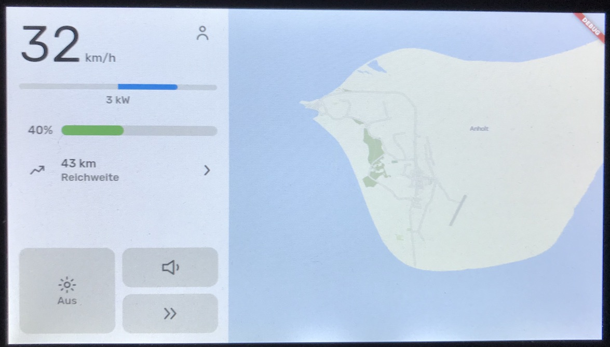

# Kart Project

A [flutter-pi](https://github.com/ardera/flutter-pi)-app running on a RaspberryPi 4, being the infotainment system for a custom builded e-kart,
planned by two brothers.

## Features
### Drive information
For sure, you should be able to see how fast you drive and how much engery you currently need. As a controller we are using the [VEC 500 from
Golden Motors](https://goldenmotor.com). Thanks to @SunnyWolf how has already created a [repo](https://github.com/SunnyWolf/goldenmotor_protocol)
with commands to use to communicate with the VEC 500 over UART.

### Lights control
We are using [2760lm leds](https://www.leds.de/nichia-nfcwl060b-v2-chip-on-board-modul-2760lm-5000k-cri-80-30608.html) for lightning. Because
2760lm is very bright, we implemented PWM with the [wiringPi Library](http://wiringpi.com). This gives us the option to dim the lights whenever
somebody is coming along. We are also planning to make the back lights be brighter whenever you brake.

### Music control
We are using some old speakers to play music on the kart while driving or to hoot. Our goal is it, to be able to connect your smartphone with
the Raspberry Pi over Bluetooth to stream audio. This is still in early states and needs some work done.

### Profil options
We had the idea of having multiple profiles, so when you are using the kart, all settings are as you left of. This is also helpful when smaller
kids are driving with the kart because you should be able to shrink the maximum speed.

### Map
We are also planning to add a map and already made it in some way with the [flutter_map](https://pub.dev/packages/flutter_map#offline-maps) package.

## Still in process...
This project is not even near to finish but I already want to thank @ardera as the creator of [flutter-pi](https://github.com/ardera/flutter-pi)
who already helped me in various situations.

The current goal is to finish the different interfaces needed to cummincate with all the necessary devices. If you already found some bad code,
something to improve or just have a question about the project at all feel free to open an issue or write an [e-mail](mailto:matzesoft@gmail.com).
